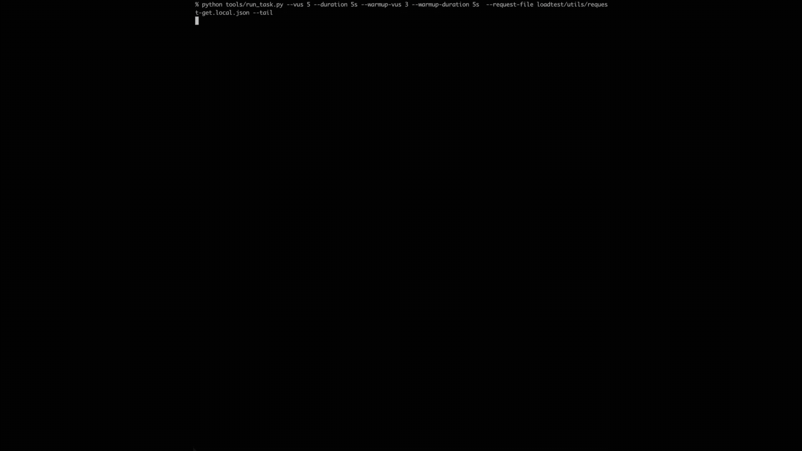
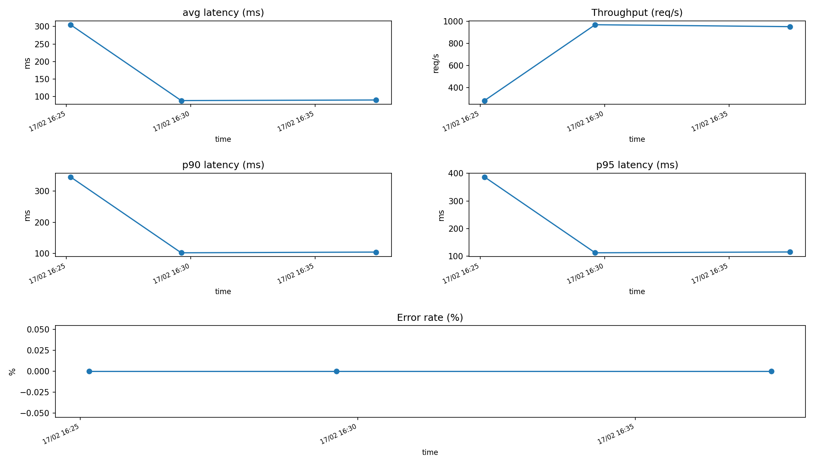

# k6-fargate-api-loadtest

Run repeatable k6 API load tests from AWS Fargate (not your laptop). Each run is an ephemeral Fargate task; results are uploaded to S3 and logs go to CloudWatch.



## Contents

- [What this is (and is not)](#what-this-is-and-is-not)
- [Why this exists (vs running k6 locally)](#why-this-exists-vs-running-k6-locally)
- [Architecture (what runs where)](#architecture-what-runs-where)
- [Quick Start](#quick-start)
- [CI](#ci)
- [Execution Flow](#execution-flow)
- [Results](#results)
- [Logs](#logs)
- [Networking Model](#networking-model)
- [Image Tagging (reproducibility)](#image-tagging-reproducibility)
- [Troubleshooting](#troubleshooting)
- [Security Notes](#security-notes)
- [Cost & Cleanup](#cost--cleanup)
- [Publishing checklist](#publishing-checklist)

## What this is (and is not)

This is:
- A repeatable way to generate load from a consistent AWS environment.
- A learning-friendly reference for ECS/Fargate + k6 + Terraform.

This is not:
- A full load-testing platform (no UI, no scheduler, no long-running control plane).
- A production “performance testing service”.

## Why this exists (vs running k6 locally)

Running load tests from a laptop is often misleading:

- ISP / Wi‑Fi variability adds noise
- Local CPU throttling affects throughput
- NAT / routing changes impact latency
- Harder to reproduce across teammates

This repo provisions a small, consistent load generator in AWS:

- k6 runs inside a Fargate task
- Results uploaded to S3 (`summary.json`)
- Logs stored in CloudWatch Logs
- Everything triggered via simple Python tools (no long-running services)

## Architecture (what runs where)

### On your laptop

- `infra/terraform/` provisions AWS resources (Terraform)
- `tools/build_push.py` builds + pushes the Docker image to ECR
- `tools/run_task.py` starts a Fargate task, prints `RUN_ID`, optional `--tail`

### In AWS

- ECR: container registry
- ECS/Fargate: executes k6
- CloudWatch Logs: container logs
- S3: stores `summary.json`



## Quick Start

### Prerequisites

- AWS credentials configured locally (via SSO, `~/.aws/credentials`, env vars, etc.)
- Terraform >= 1.5
- AWS CLI v2 (used for `aws ecr get-login-password`)
- Docker + buildx
- Python 3.11+ (venv recommended)

Notes:
-   Default region is `eu-west-1` (Terraform `var.region`, tools read `AWS_REGION`).
-   This repo intentionally defaults to public subnets + public IP for cost/simplicity.

### 1) Create virtual environment

```bash
python3 -m venv .venv
source .venv/bin/activate
pip install -r tools/requirements.txt

# Optional (contributors): linting
pip install -r tools/requirements-dev.txt
```

Windows PowerShell:

```powershell
python -m venv .venv
.venv\Scripts\Activate.ps1
pip install -r tools\requirements.txt

# Optional (contributors): linting
pip install -r tools\requirements-dev.txt
```

### 2) Provision infrastructure

```bash
cd infra/terraform
terraform init
terraform apply
```

> **Remote state (recommended for shared use):** By default Terraform stores state locally in `terraform.tfstate`. If you lose that file you lose the ability to manage or destroy the infrastructure. A ready-to-use S3 + DynamoDB backend template is provided at `infra/terraform/backend.tf.example` — copy it to `backend.tf`, fill in your bucket/table names, and re-run `terraform init` to migrate.

### 3) Build & push image

```bash
python3 tools/build_push.py
```

By default this pushes a stable tag (defaults to `IMAGE_TAG=stable`) and also pushes an immutable build tag like `build-YYYYMMDDHHMMSS`.

### 4) Run tests

1) Create a local request config (recommended)

The committed files under `loadtest/utils/` are intentionally safe templates (they point at `example.com`).
For real targets, copy one to a local-only file (ignored by git):

```bash
cp loadtest/utils/request.json loadtest/utils/request.local.json
```

Then edit `loadtest/utils/request.local.json` to point at your target.

2) Start a run:

```bash
python3 tools/run_task.py \
  --vus 50 \
  --duration 1m \
  --warmup-vus 10 \
  --warmup-duration 15s \
  --sleep-ms 10 \
  --request-file loadtest/utils/request.local.json \
  --tail
```

If you add `--fetch-and-append`, the tool will automatically download the result and append it to the local run history when the task finishes (so you can skip step 3):

```bash
python3 tools/run_task.py \
  --vus 50 \
  --duration 1m \
  --warmup-vus 10 \
  --warmup-duration 15s \
  --sleep-ms 10 \
  --request-file loadtest/utils/request.local.json \
  --tail \
  --fetch-and-append
```

The tool prints a `RUN_ID` and the S3 location where results will be uploaded.

3) Download and/or extract the result:

If you ran with `--fetch-and-append`, skip this step.

`tools/fetch_and_append.py` is the "one command" path: it downloads the run (`tools/fetch_run.py`) and then extracts metrics (`tools/extract_run_metrics.py`) and appends them to `test-results/runs.jsonl`.

```bash
python3 tools/fetch_and_append.py <RUN_ID>
python3 tools/fetch_run.py <RUN_ID>
python3 tools/extract_run_metrics.py test-results/<RUN_ID>/summary.json
```

4) See Graphs:
```bash
python3 tools/plot_runs.py
```

## CI

A lightweight CI pipeline enforces Terraform formatting/validation and basic Python static checks.

It runs:
- Terraform `fmt` + `validate`
- Python `compileall`
- Ruff (basic `F` checks)

## Execution Flow

1. `tools/run_task.py` calls ECS `RunTask`
2. ECS launches a Fargate task with a command override: `run /tests/scenarios/<scenario>.js`
3. Container `ENTRYPOINT` executes `entrypoint.sh`
4. `entrypoint.sh` runs k6
5. k6 `handleSummary()` writes `/tmp/summary.json`
6. After k6 exits, `entrypoint.sh` attempts to upload `summary.json` to S3 (only when k6 exits successfully)
7. Task stops

Dockerfile CMD is only a fallback and normally overridden by ECS.

## Results

Each run generates a unique RUN_ID.

S3 location:

`s3://<results-bucket>/runs/<RUN_ID>/summary.json`

Local downloads are stored under `test-results/` by default (this folder is ignored and should not be committed).

## Logs

CloudWatch Log Group:

`/ecs/k6-fargate-loadtest`

Streams:

`run/<container>/<task_id>`

## Networking Model

Current setup:

-   Public subnets
-   assignPublicIp = ENABLED
-   Security group egress: HTTPS (TCP 443) to `0.0.0.0/0`

Chosen for cost efficiency (no NAT, no endpoints).

If you see name-resolution errors (e.g., failures resolving hostnames), some environments require explicit SG/NACL egress to the VPC resolver (UDP/TCP 53).

If your organization requires private networking, you can adapt this to private subnets + NAT or VPC endpoints (not the default here).

## Image Tagging (reproducibility)

Terraform config uses `var.image_tag` (default `stable`) for the ECS task definition.

To run an immutable build tag without re-applying Terraform, `tools/run_task.py` supports:

```bash
python3 tools/run_task.py --image-tag build-YYYYMMDDHHMMSS --tail
```

This registers a one-off task definition revision for the run.

## Troubleshooting

No logs while tailing: CloudWatch streams may appear after a few
seconds.

Task failed: Check CloudWatch logs using printed stream name.

Many untagged ECR images: Normal with multi-arch builds. Lifecycle
cleanup is asynchronous.

## Security Notes

- No inbound rules on task SG
- Task role limited to `s3:PutObject` on results prefix
- Target API auth can be passed via env vars if needed (`TARGET_API_KEY` / `TARGET_BEARER_TOKEN`)

Important:
-   **ECS task overrides are logged in CloudTrail.** Every `RunTask` call records all container override environment variables — including `TARGET_API_KEY`, `TARGET_BEARER_TOKEN`, and the full `REQUEST_JSON` payload (URL, headers, body) — in CloudTrail and in `ecs:DescribeTasks` responses. Any principal with CloudTrail read access or `ecs:DescribeTasks` can see these values.
-   **Never put auth credentials in `request.json` headers.** Use `TARGET_API_KEY` / `TARGET_BEARER_TOKEN` env vars exclusively for credentials. Be aware those are also visible in CloudTrail.
-   Avoid putting secrets inside request JSON files. Never commit secrets.
-   In shared AWS accounts, restrict CloudTrail read access and `ecs:DescribeTasks` permissions to limit exposure of task environment variables.

## Cost & Cleanup

Costs come mainly from CloudWatch Logs, S3 storage, and ECR storage (plus Fargate runtime while a test runs).

Cleanup:

```bash
cd infra/terraform
terraform destroy
```

If you want to purge images immediately, delete them from ECR (the repo also has a lifecycle policy, but it’s not instant).

## Publishing checklist

Before making this repository public:
- Ensure no `*.tfstate` files, `.terraform/`, `.venv/`, or `test-results/` artifacts are committed.
- Keep request templates sanitized; store real targets in `loadtest/utils/*.local.json`.
- Confirm the results bucket policy enforces TLS-only access.
